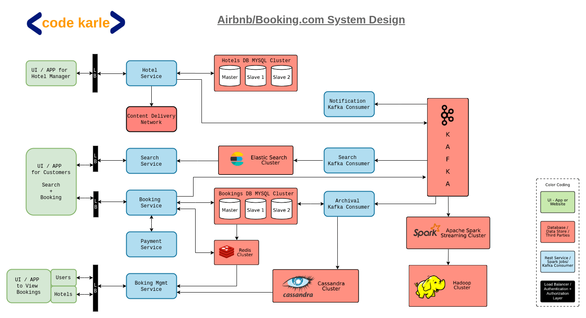

##### Functional Requirements
* Hotel
  * Onboarding
  * Update properties ( add room, change pricing, add new Images etc)
  * Report to see bookings, revenue etc
* User
  * search for location based on filters like price range, star rating
  * Book hotel
  * Check booking
  * Analytics

##### Non Functional Requirement
* Low latency
* High Availability
* High Consistancy
* scale

#### System Design

* _UI -> LB -> Hotel Service -> (CDN for Image Storage, Mysql for Url Storage, Kafka)_
* _Search UI -> LB -> Search Service -> Elastic Search Server -> search consumer -> Kafka_
* _Book UI -> LD -> (Booking Service, payment Service) -> MySql -> Archival service -> kafka ->. Notification Service
* _Bookings UI -> LB -> Booking Management svc --> (redis, cassendra) -> kafka -> Hadoop



```  ```

#### API Design
* Hotel
 * __POST__ /hotel
 * __GET__ /hotel/:id
 * __PUT__ /hotel/:id
 * __PUT__ /hotel/:id/rooms/:id

* Booking
 * __POST__ /book userId, roomId, quantity, startDate, endDate
 * 
 * 

#### Database Design
* Hotel
 * Hotel : id, name, location, description, original_image, display_image, is_active
 * hotel_fecility: id, hotel_id, facility_id, is_active
 * roooms: id, hotel_id, display_name, is_active, quantity, price_min, price_max
 * rooms_facilities: id room_id, facility_id, is_active
 * facilities: id, display_name
 * locality: id, city_id, state_id, country_id, zip_code, is_active
 * Audit: 
* Booking
 * available_rooms: room_id, date, initial_qty, available_qty
 * booking: booking_id, room_id, user_id, start_date, end_date,invoice_id, status(reserved, booked, canceled, completed), no_rooms
 * 

