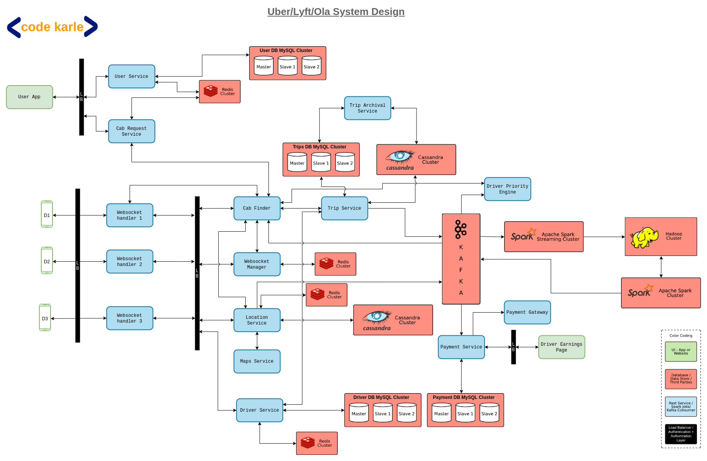

#### Functional Requiremnets
* See Cabs
* ETA and Approx price
* Book a Cab
* location tracking

#### non Functional Requirements
* High Availability
* global
* low latency
* High consistance
* scale
    * 100 million monthly active users
    * 14 million users every day.

#### System Design

* Architecture

* frontend
    * User UI
    * Driver UI

* Backend Services
    * User service
    * Cab Request Service
    * websocket handler1,websocket handler2, websocket handler3
    * cab finder
    * websocker manager
    * location service
    * map service
    * driver service
    * trip service
    * trip archival service
    * driver priority engine
    * payment service

* Other servers
    * Redis
    * User DB Mysql
    * trip db Mysql
    * cassandra
    * driver db Mysql
    * payment db Mysql
    * kafka server
    * Hadoop
    * Spark cluster
    * spark streaming

