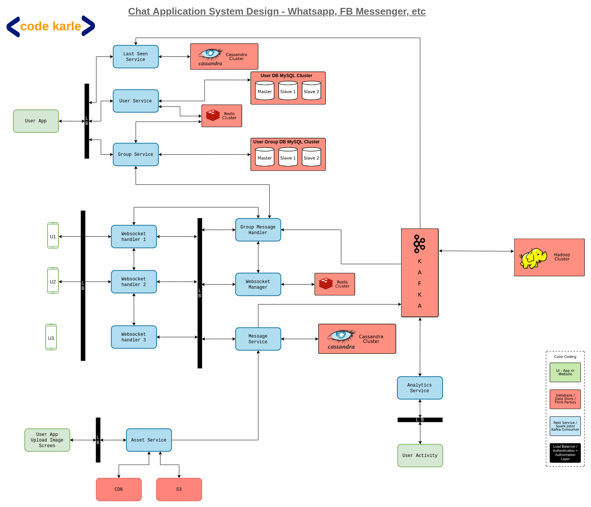

#### Functional Requirements
* one-to-one chat
* group chat
* Text, image, videos
* Read Receipt
* last seen

#### Non Functional Requirements
* low latency
* High Availability
* No Lag
* scale Eg: whatsapp
  * 2 billion user
  * 1.6 Billion MAV
  * 65 Billion msgs/day

#### System Design

* Architecture Design

* Application Design
* Frontend
 * User App
 * User App Upload Image
* Backend
 * User Service
 * Last Seen service
 * Group Service
 * Message Service
 * Asset Service
 * Analytics Service
 * Group Message hander
 * Websocket Manager
 * Websocket handler1
 * Websocket handler2
 * Websocket handle3

* Other Servers
 * CDN
 * S3
 * Cassandra
 * Redis
 * Kafka
 * MySql

