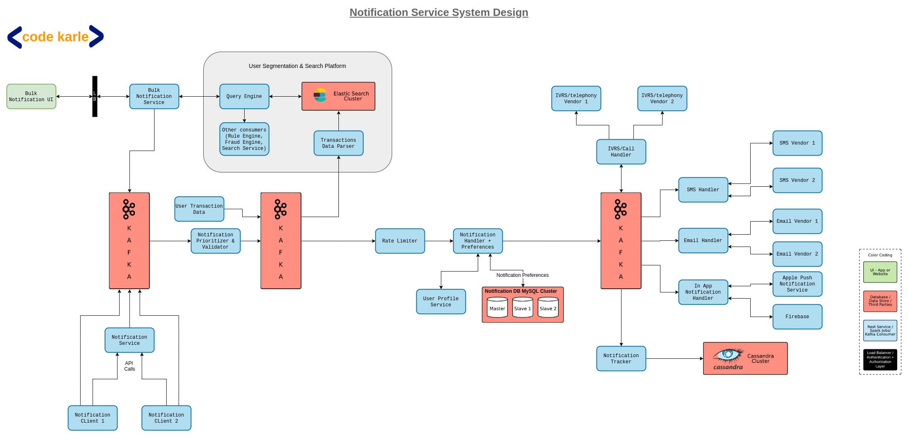

#### Functional Requirement
* Send Notifications
* plugable
* SaaS
* Prioritization

#### Non Functional Requirement
* High Availability
* Many Clients

#### System Design

* Architecture Design

* Frontend pages
    * Bulk Notification UI

* Backend Service
    * Bullk Message Service
    * search Service
    * translation Data parser
    * User Transaction Data
    * Notification Prioritizer and Validator
    * Notification Service
    * Notification Client1
    * Notification Client2
    * Rate Limiter
    * User Prifile service
    * Notification handler Service
    * IVRS Call handler (IVRS vendors)
    * SMS Handler (SMS Vendors)
    * Email Handler (Email Venders)
    * In App Notification Handler (Firebace, Apple Push Notification Service)

* Other Servers
    * Elastic Search Server
    * Kafka Server
    * Nofication DB MySql
    * Cassandra DB
